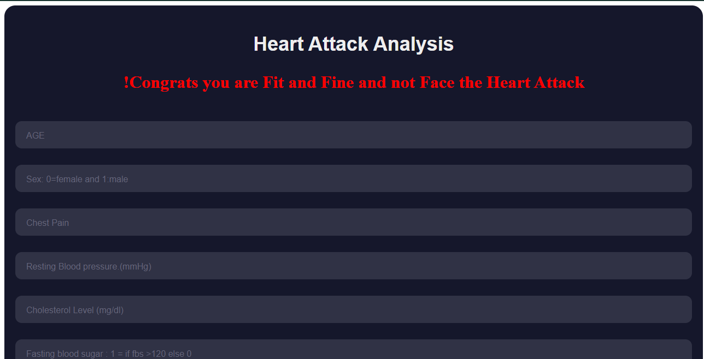

# Heart Attack Analysis

This project aims to analyze and predict the occurrence of heart attacks based on various risk factors and medical attributes.

## Introduction

Heart disease is a leading cause of death worldwide. Early detection and prediction of heart attacks can help in timely intervention and prevention. This project utilizes a dataset of patients' medical records to analyze patterns and build a predictive model for heart attack occurrence.

## Dataset

The dataset used in this project are upload in Data. It contains various attributes such as age, gender, blood pressure, cholesterol levels, and other medical indicators for a group of patients. The dataset has been preprocessed and cleaned for analysis purposes.

## Installation

To use this project locally, follow these steps:

1. Install the required dependencies:
### --> pip install -r requirements.txt

2. Run the analysis script:
### --> view.py     

## Usage

Once the project is set up, you can use it for various purposes:

- Explore the dataset and analyze the distribution of different attributes.
- Perform statistical analysis to identify correlations and trends.
- Build machine learning models to predict heart attack occurrence based on the provided data.
- Evaluate the model's performance and fine-tune it for better accuracy.

## Results

The results of the heart attack analysis are presented in the following forms:

- Visualizations such as bar charts, histograms, and scatter plots to illustrate the data patterns.
- Evaluation metrics for the predictive models, including accuracy, precision, recall, and F1-score.
- Insights and findings derived from the analysis, highlighting the significant factors associated with heart attack occurrence.

### App Screenshots

